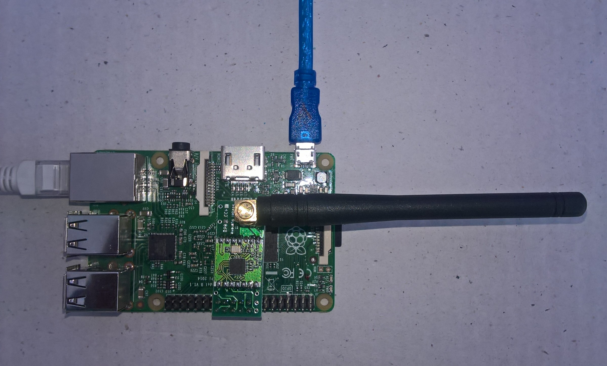

# RFM69HCW-Net
A C# library for HopeRF [@RFM69](https://www.hoperf.com/modules/rf_transceiver/RFM69W.html) or Semtech [@SX1231](https://www.semtech.com/products/wireless-rf/fsk-transceivers/sx1231) equipped shields on  Windows 10 IoT Core Raspbery PI devices.

The repo has the source code for the series of blog posts written as I built this library

01. [SPI](https://blog.devmobile.co.nz/2019/05/27/rfm69-shield-library-part1/)
02. [Register Dump](https://blog.devmobile.co.nz/2019/05/28/rfm69-shield-library-part2/)
03. [Reset](https://blog.devmobile.co.nz/2019/06/11/rfm69-hat-library-part3/)
04. [Transmit basic](https://blog.devmobile.co.nz/2019/06/25/rfm69-hat-library-part4a/) with [iwanders plainRFM69](https://blog.devmobile.co.nz/2019/06/26/rfm69-hat-library-part4b/) and [rasmatic RFM69 Arduino Library](https://blog.devmobile.co.nz/2019/06/26/rfm69-hat-library-part4c/)
05. [Receive basic](https://blog.devmobile.co.nz/2019/06/29/rfm69-hat-library-part5/)
06. [Receive interrrupt](https://blog.devmobile.co.nz/2019/06/30/rfm69-hat-library-part6/)
07. [Transmit interrrupt](https://blog.devmobile.co.nz/2019/07/01/rfm69-hat-library-part7/)
08. [Receive transmit interrupt](https://blog.devmobile.co.nz/2019/07/02/rfm69-hat-library-part8/)
09. [Addressing](https://blog.devmobile.co.nz/2019/07/06/rfm69-hat-library-part9/)
10. [Encryption](https://blog.devmobile.co.nz/2019/07/08/rfm69-hat-library-part10/)
11. [Register manager refactor](https://blog.devmobile.co.nz/2019/07/10/rfm69-hat-library-part11/)
12. [Enums & masks](https://blog.devmobile.co.nz/2019/07/14/rfm69-hat-library-part12/), [Encryption](https://blog.devmobile.co.nz/2019/07/17/rfm69-hat-library-part12b/), [Synchronisation](https://blog.devmobile.co.nz/2019/07/17/rfm69-hat-library-part12c), [Addressing & CRCs](https://blog.devmobile.co.nz/2019/07/22/rfm69-hat-library-part12d/)

I had some problems with the library locking receiving messages under load
* [Receive lockup](https://blog.devmobile.co.nz/2019/07/20/rfm69-hat-library-receive-lockups/)
* [Receive lockup debugging](https://blog.devmobile.co.nz/2019/07/21/rfm69-hat-library-receive-lockup-debugging/)

My main use case for the Library is a telemetery field gateway uploading data from a number of remote devices.

* AdaFruit Radio Bonnet [433MHz](https://www.adafruit.com/product/4073) or [868/915MHz](https://www.adafruit.com/product/4072)

* Seegel Systeme [RaspyRFM-II](https://www.seegel-systeme.de/produkt/raspyrfm-ii/)

